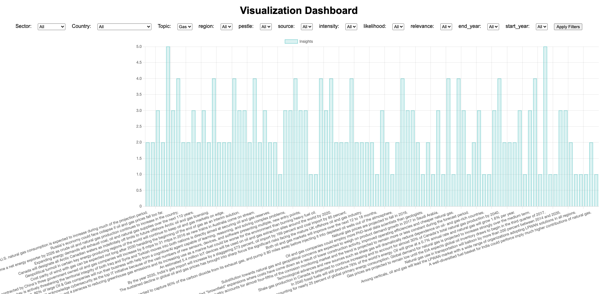
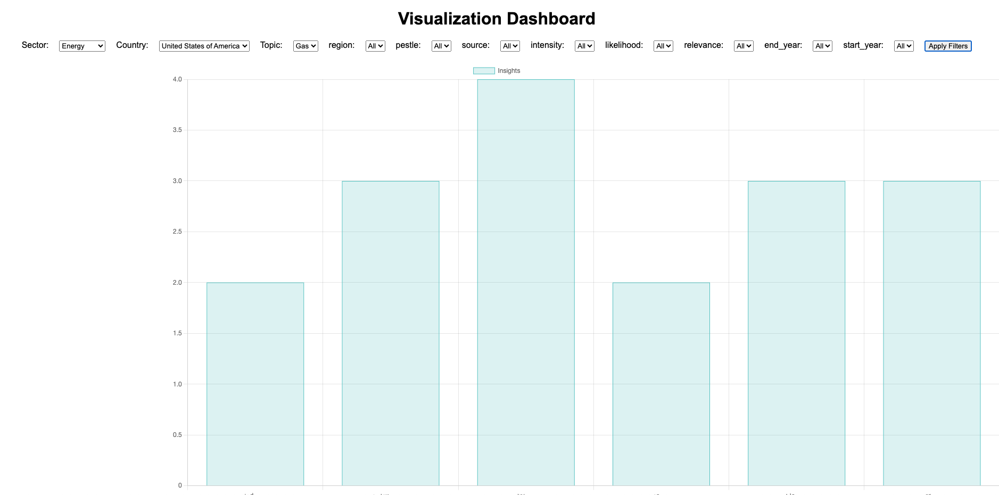

## CLI change to folder location
```
cd /Users/user/Visualization_Dashboard
```
## Setup Environment
```
python3 -m venv env
source env/bin/activate
```
## Install Required
```
Try:

pip3 install -r requirements.txt

Else: 

python3 -m pip install -r requirements.txt

```
## Any update in CLF run this command after install
```
pip3 freeze > requirements.txt
```
## Run Flask
```
export FLASK_APP=app.py;
export FLASK_ENV=development # enables debug mode
flask run --reload
```

## Output



